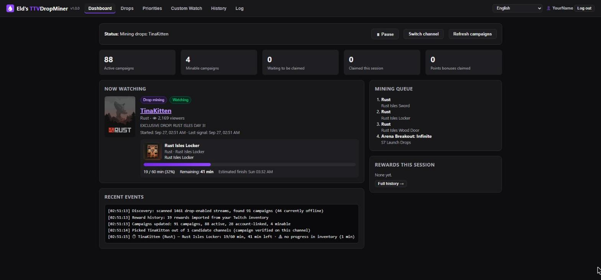
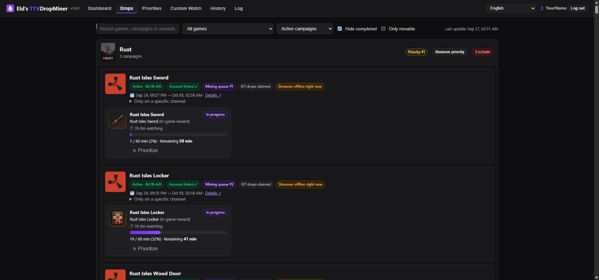
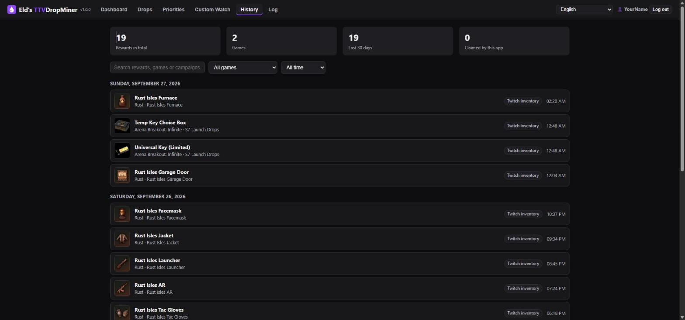
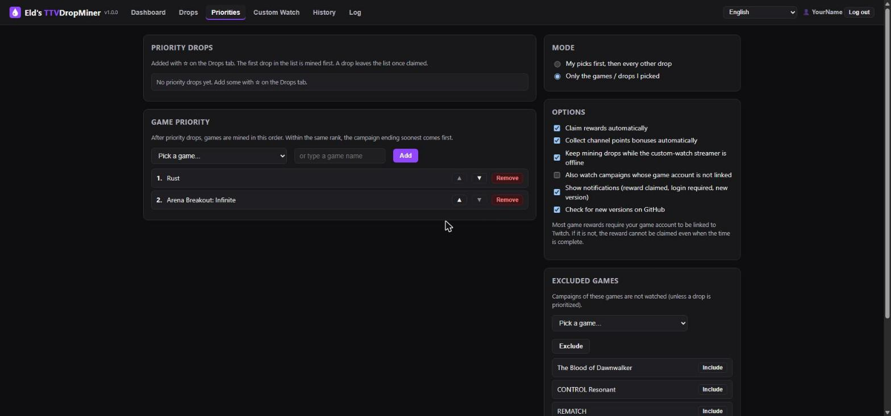

<div align="center">


# Eld's TTVDropMiner

### Free Twitch Drops miner for Windows

**Farm and auto-claim Twitch Drops while you're AFK, without downloading a single frame of video.**

[](../../releases/latest)
[](../../releases)
[](LICENSE.md)

[](#-installation)
[](#from-source)
[](https://www.twitch.tv/drops/campaigns)
[](#-languages)
[](TERMS.md#7-privacy)
[](https://buymeacoffee.com/eldrithc_)

[**⬇️ Download**](../../releases/latest) · [Features](#-features) · [Installation](#-installation) · [Usage](#-usage) · [Terms of Use](TERMS.md) · [☕ Support](#-support)



</div>

---

Eld's TTVDropMiner is a free, open-source **Twitch Drops miner** (also called a Twitch drop farmer)
for Windows 10 and 11. It watches drop-enabled Twitch streams in the background without playing
any video, tracks your drop progress, switches channels when a stream goes offline and claims
every reward automatically, including channel points. Log in once, set the games you care
about and leave it running.

## ✨ Features

| | |
|---|---|
| 🔎 **Finds every campaign** | Scans the drop-enabled streams of the top games and your priority games. It also finds streamer-specific campaigns and ones whose streamers are offline right now. |
| 📺 **Picks the right channel** | Checks that the channel really gives progress, and switches channel automatically when a stream stalls. |
| ✅ **Real progress checks** | Checks progress against your Twitch inventory every minute. It also tracks several drops that progress on the same stream. |
| 🎁 **Auto-claim** | Claims rewards the moment they are ready, and collects channel points bonuses too. |
| ⭐ **Priorities** | Pin drops, order games or exclude games. Mine only your picks, or your picks first and then everything else. |
| 👀 **Custom watch** | Queue streamers to watch for a set time before drop mining continues. |
| 📜 **Reward history** | Kept between sessions. Rewards you claimed earlier are imported from your Twitch inventory. |
| 🎮 **Discord Rich Presence** | Shows the game and drop you're mining on your Discord profile. You can turn it off in the settings. |
| 🔔 **Notifications** | Windows notifications for claimed rewards, required logins and new versions. |
| 🪟 **Desktop app** | Runs in its own window, hides to the system tray and can start with Windows. |
| 🌍 **7 languages** | Detects your Windows language automatically. |
| 🪶 **Lightweight** | No video or audio is downloaded, so it uses almost no bandwidth or CPU. |

<details>
<summary><b>📸 More screenshots</b></summary>
<br>

| Drops | Reward history |
|:---:|:---:|
|  |  |

| Priorities |
|:---:|
|  |

</details>

## ⚠️ Read this before installing

> [!WARNING]
> **Using this app can get your Twitch account locked, suspended or banned.**
>
> - Automated watching is **against [Twitch's Terms of Service](https://www.twitch.tv/p/legal/terms-of-service/)**.
>   Twitch or a game publisher may lock your account, ask for CAPTCHAs, void your Drops,
>   or suspend or ban your Twitch or game account, at any time and without warning.
> - **You use this app entirely at your own risk.** The author is not responsible for lost
>   accounts, Drops, items or anything else, and cannot restore or compensate them.
> - The app comes **as is, with no warranty**. It may stop working whenever Twitch changes
>   its site or API.
> - This project is **not affiliated with or endorsed by Twitch**, Amazon, or any game
>   publisher or streamer.
> - Don't use it on an account you can't afford to lose.

> [!IMPORTANT]
> By installing or using the app you agree to the **[Terms of Use](TERMS.md)**.

## 📦 Installation

### Installer (recommended)

1. Download **`EldsTTVDropMiner-vX.Y.Z-Setup.exe`** from the [latest release](../../releases/latest).
2. Run it. No admin rights are needed.

- The installer offers a desktop shortcut and **start with Windows** (the app then starts hidden in the tray).
- The app is installed to `%LOCALAPPDATA%\Programs\EldsTTVDropMiner`.
- Your data (settings, login, history, log) lives in `%LOCALAPPDATA%\EldsTTVDropMiner\data`.

> [!NOTE]
> The installer is not code-signed, so Windows SmartScreen may warn you the first time.
> Click **More info → Run anyway**.

### From source

Requires **Python 3.10+** on Windows.

1. Download the source ZIP from the [latest release](../../releases/latest) and extract it.
2. Double-click **`Start.bat`**. The first run creates a virtual environment and installs the requirements.

When you run from source, your data is kept in the `data\` folder next to the code.
If you prefer the dashboard in your browser, run `.venv\Scripts\python.exe main.py` instead
and open <http://127.0.0.1:8765>.

## 🚀 Usage

1. **Log in:** on first launch the dashboard shows an 8-character code. Enter it at
   [twitch.tv/activate](https://www.twitch.tv/activate). You only need to do this once.
2. **Link your game accounts** to Twitch. Most game drops can't be claimed without a link, and
   the **Drops** tab shows a *Link account* button for each campaign that needs one.
3. **Set priorities** (optional) on the **Priorities** tab.
4. **Leave it running.** Closing the window hides the app to the tray. To stop it, choose
   **Quit** from the tray menu.

> [!TIP]
> Only one copy runs at a time, because Twitch counts a single watcher per account.
> Opening the app again just brings the existing window to the front.

## 🌍 Languages

English · Türkçe · Español · Português (Brasil) · Deutsch · Français · Русский

The strings live in `locales/<code>.json`. To add or improve a language:

1. Copy `locales/en.json` to a new file.
2. Translate the values, keeping the `{placeholders}`, and set `_meta.name`.
3. Run `python tools/check_locales.py`.

A key ending in `_one` is an optional singular form, used when a count is 1.
Pull requests with translations are welcome!

## 🛠️ Building

```bat
build.bat
```

The script does the following:
1. Checks the translations.
2. Builds `dist\EldsTTVDropMiner\` with PyInstaller.
3. Creates `dist\EldsTTVDropMiner-v<version>-Setup.exe` with
   [Inno Setup 6](https://jrsoftware.org/isinfo.php), which you can install with
   `winget install JRSoftware.InnoSetup`.

The version number lives in `version.py`. So does the GitHub owner/repo used by the update
check, which is skipped while those are placeholders.

## ❓ FAQ

<details>
<summary><b>How do I farm Twitch Drops automatically?</b></summary>
<br>
Install the app, log in with the code it shows at twitch.tv/activate and link your game
accounts to Twitch. The miner then finds active drop campaigns, watches a stream that gives
progress and claims each drop as soon as it is ready.
</details>

<details>
<summary><b>Does it download or play the stream?</b></summary>
<br>
No. It sends the same "minute watched" signal the Twitch player sends, so it uses almost no
bandwidth or CPU. You can keep using your PC or play games while it runs.
</details>

<details>
<summary><b>Is it safe to use? Can I get banned?</b></summary>
<br>
The app doesn't collect any data and only talks to Twitch, GitHub and your local Discord client.
Automated watching is still against Twitch's Terms of Service, so there is always a risk to your
account. Read <a href="#%EF%B8%8F-read-this-before-installing">Read this before installing</a>.
</details>

<details>
<summary><b>Why isn't my drop progressing?</b></summary>
<br>
Most often the game account isn't linked to Twitch, or the campaign only counts on certain
channels. The Drops tab shows a <i>Link account</i> button when a link is needed, and the miner
switches channel on its own when a stream stops giving progress.
</details>

<details>
<summary><b>Does it work on macOS or Linux?</b></summary>
<br>
Not officially. The desktop app, tray and installer are Windows-only.
</details>

## ☕ Support

The app is free and always will be. If it saved you some time and you'd like to say thanks,
you can **[buy me a coffee](https://buymeacoffee.com/eldrithc_)**. The same link is in the app's
header and in the tray menu.

<a href="https://buymeacoffee.com/eldrithc_"></a>

## 📄 License

Copyright (c) 2026 **Eldrithc_**. Licensed under the
**[PolyForm Noncommercial License 1.0.0](LICENSE.md)**. Here is a summary; the license and
the [Terms of Use](TERMS.md) are what count:

| | |
|:---:|---|
| ✅ | You may use, change and share the app **for noncommercial purposes**. |
| ❌ | You may not sell it, offer it as a paid service, or make money with it in any other way. |
| 📝 | When you share it or a modified version, include the license and credit the original: *"Based on Eld's TTVDropMiner by Eldrithc_"*. |
| 🏷️ | A fork may keep the name only with a suffix that names its author, for example **"Eld's TTVDropMiner forked by YourName"**. |

<div align="center">
<br>
<sub>Made by <b>Eldrithc_</b> · Not affiliated with Twitch</sub>
</div>
